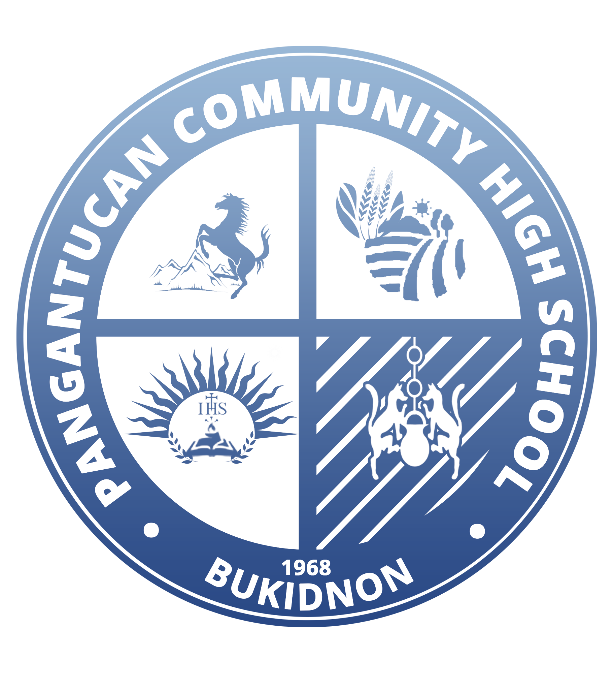

# Financial System for Pangantucan Community High School (PCHS)

## :warning: Under Development

---

## Features

- [x] Multi-User Support
- [x] Admin Dashboard
- [x] Login System
- [x] Collections
- [x] Student Ledger
- [x] Transactions
- [ ] Generate Reports (Daily/Monthly)
- [x] Balance Sheet
- [ ] Cash Flow Statement
- [ ] Income Statement

## App Scope and Limitations

- Single Device Only __(due to the limitations of SQLite, this may change in the future)__

---

## Technologies Used

- C# (.NET Framework 4.7.2)
- IronXL (still in testing)
- SQLite

---

## Contributors

- Sean Baang :philippines:
- Michael Pagaran :philippines:
- Alexis Galaura :philippines:
- Gecel Rodriguez :philippines:
- Joseph Rosales :philippines:
- Gian Paredes :philippines:
